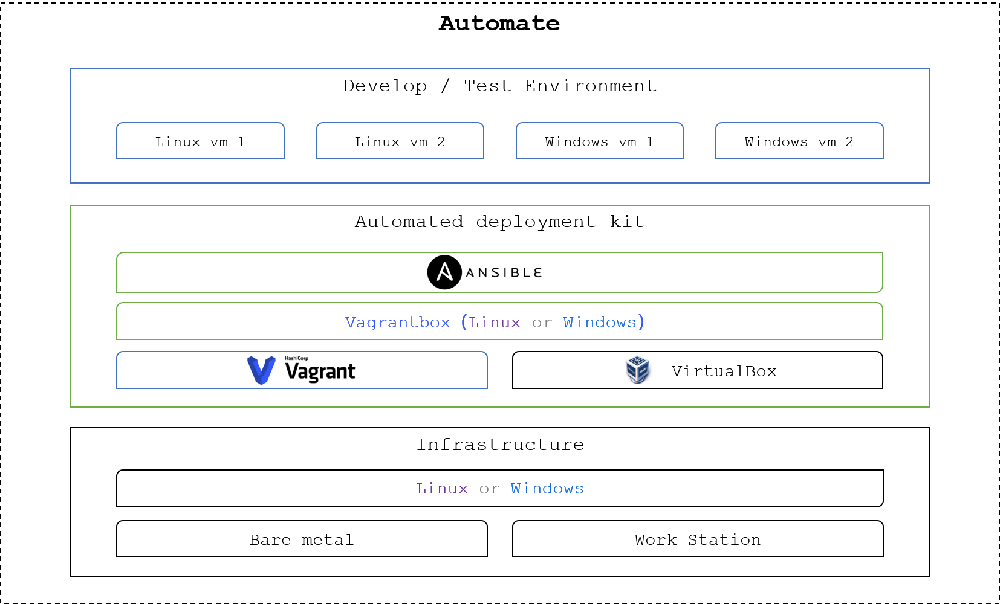
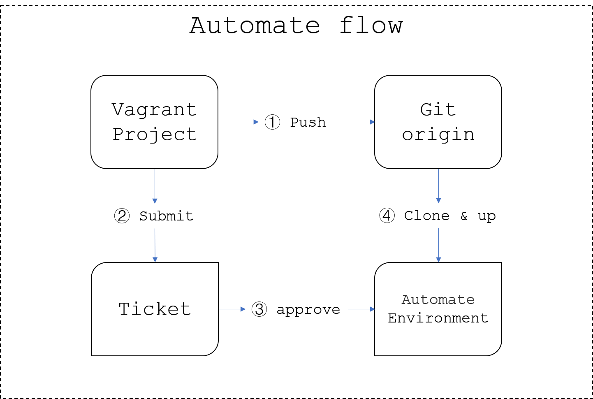

# 测试环境管理

## 测试环境架构

* 以裸机或者工作站为基础，操作系统可以是linux或者window;

* 在上面的基础之上，部署自动化套件，提供自动化平台；

* 运用测试环境管理能力，批量启动需要的虚拟机。

## 自动化工作流

1. 开发、测试、运维人员编写Vagrant工程文件，并提交到Git仓库；

2. 负责人向管理员提交工单需求，申请自动化平台资源；

3. 管理员审批工单需求，并同意新虚拟机群准入；

4. 管理员拉取Vagrant工程，执行测试环境管理，并校验。

## 现有环境梳理

1. 本篇测试环境，既不取代软件在客户现场的部署方式，也不覆盖项目组中个性化的需求（基于其他虚拟化）。

2. 容器平台依然为容器化部署项目的主要部署地，假如需要验证部署方案，本篇方案是首选。

3. 测试环境伴随测试工作，应该是一个多变的临时的环境，也即每次测试迭代都应该从初始环境开始，而不应该携带上一次测试留下的痕迹，测试迭代结束后应该立即清理本轮测试环境。

4. 后期，我们会加上持续部署工具，以辅助我们对环境的管理。

