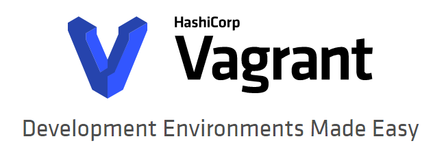

Vagrant
===



- [Vagrant](#vagrant)
- [1. 简介](#1-%e7%ae%80%e4%bb%8b)
  - [1.1. Why Vagrant？](#11-why-vagrant)
    - [1.1.1. 尽可能避免"在我得电脑上是好的"错误](#111-%e5%b0%bd%e5%8f%af%e8%83%bd%e9%81%bf%e5%85%8d%22%e5%9c%a8%e6%88%91%e5%be%97%e7%94%b5%e8%84%91%e4%b8%8a%e6%98%af%e5%a5%bd%e7%9a%84%22%e9%94%99%e8%af%af)
    - [1.1.2. 缩短搭建开发环境的时间](#112-%e7%bc%a9%e7%9f%ad%e6%90%ad%e5%bb%ba%e5%bc%80%e5%8f%91%e7%8e%af%e5%a2%83%e7%9a%84%e6%97%b6%e9%97%b4)
    - [1.1.3. Vagrant的主要使用者](#113-vagrant%e7%9a%84%e4%b8%bb%e8%a6%81%e4%bd%bf%e7%94%a8%e8%80%85)
  - [1.2. 对比](#12-%e5%af%b9%e6%af%94)
    - [1.2.1. Vagrant vs CLI工具](#121-vagrant-vs-cli%e5%b7%a5%e5%85%b7)
    - [1.2.2. Vagrant vs Docker](#122-vagrant-vs-docker)
    - [1.2.3. Vagrant vs Terraform](#123-vagrant-vs-terraform)
- [2. 入门](#2-%e5%85%a5%e9%97%a8)
  - [2.1. 安装](#21-%e5%ae%89%e8%a3%85)
    - [2.1.1. CentOS 7.6](#211-centos-76)
    - [2.1.2. Windows 10](#212-windows-10)
  - [2.2. 项目设置](#22-%e9%a1%b9%e7%9b%ae%e8%ae%be%e7%bd%ae)
  - [2.3. Boxes](#23-boxes)
    - [2.3.1. 安装box](#231-%e5%ae%89%e8%a3%85box)
    - [2.3.2. 使用box](#232-%e4%bd%bf%e7%94%a8box)
  - [2.4. 启动并连入](#24-%e5%90%af%e5%8a%a8%e5%b9%b6%e8%bf%9e%e5%85%a5)
  - [2.5. 同步文件夹](#25-%e5%90%8c%e6%ad%a5%e6%96%87%e4%bb%b6%e5%a4%b9)
  - [2.6. 供应](#26-%e4%be%9b%e5%ba%94)
  - [2.7. 网络](#27-%e7%bd%91%e7%bb%9c)
  - [2.8. 常用命令](#28-%e5%b8%b8%e7%94%a8%e5%91%bd%e4%bb%a4)

# 1. 简介

Vagrant是构建在虚拟化技术之上的虚拟机运行环境管理工具。通过Vagrant可以方便实现的对虚拟机的管理，包括建立和删除虚拟机、配置虚拟机运行参数、管理虚拟机运行状态、自动化配置和安装开发环境必须的各类软件、打包和分发虚拟机运行环境等。

Vagrant的运行，需要依赖某项具体的虚拟化技术。由于VirtualBox是一项开源的虚拟化软件，可以同时在Windows、Linux、Macintosh、SSolaris等操作系统上运行并支持众多对众多操作系统的虚拟化，因此，在Vagrant开发的初期，唯一支持的是VirtualBox。随着虚拟化技术的快速发展，现在已经有了更多的虚拟化技术可供选择。VMware、HyperV、Docker等都已经可以通过Vagrant的管理而工作。Windows的HyperV技术在部分Windows发行版本中的集成，使得Vagrant在“开盒即用”的特性方面前进了一大步。

因此，Vagrant是虚拟机管理工具，不是某项具体的虚拟化技术。对于各项虚拟化技术而言，Vagrant提供了一套基于配置文件和命令行的管理工具。也正是因为如此，Vagrant完成了对虚拟化技术在一定程度上的封装。这为将虚拟化技术引入到基于桌面运行环境的开发工作流中创造了便利条件。

## 1.1. Why Vagrant？

Vagrant提供易于配置，可重复和便携的工作环境，基于行业标准技术构建，并由单一一致的工作流程控制，以帮助您和您的团队最大限度地提高生产力和灵活性。

为了实现其魔力，Vagrant站在巨人的肩膀上。在VirtualBox，VMware，AWS或任何其他提供商之上配置计算机 。然后，行业标准 配置工具 （如shell脚本，Chef或Puppet）可以在虚拟机上自动安装和配置软件。

### 1.1.1. 尽可能避免"在我得电脑上是好的"错误

在Vagrant没有出现之前，在服务器端进行开发的人们通常都拥有一个专用的开发帐号。使用这个帐号，开发者可以在一定限度内配置自己的开发环境、完成编码、进行测试并完成向开发团队代码库的代码推送。于是，在团队合作开发的过程中，一个问题出现了：当A进行了一次新的代码推送之后，原本可以通过的代码持续集成测试无法通过了。通过代码检查，发现A的代码出现了异常。而A在自己的开发环境中的测试是可以通过的。这类错误被Vagrant称作为“Work on my machine”错误。这类错误要定位解决通常耗时很久。在一个可以进行面对面开发的团队中，问题的定位由于沟通手段的丰富相对较快。如果是分散在不同地方的人在合作开发，那么要解决此类错误，就没有那么简单了。

* 小张在自己的机器上辛苦的完成了一项功能开发，通过了本机上的各项测试，高高兴兴的向团队代码库提交的自己的工作成果。心想终于可以放松一下了。“是不是可以买一只机械键盘犒劳一下？晚上和伙伴们出去聚会吧！嘿嘿。”小A心里美滋滋的想。

* “小张，你来一下，代码有问题”。临近下班的时候，小A接到QA小组的一个电话。“怎么回事？”小张一头雾水的走进了QA小组的办公区。

* “你今天下午提交的代码，无法通过测试。你自己做了测试了吗？”，老王是QA小组测试负责人，他面色凝重的问小张，“咱们就要发布一个新的代码版本了。这个时候你的代码出问题，可能会影响代码发布的。要不你赶紧看看？明天上午能修复吗。我们的测试报告和测试规范在这里”。

* “明明没有问题的呀”，出了QA的办公区，小张仍然迷惑不解。“在我的机器上明明是可以运行的。而且为了晚上的聚会，测试规范中定义的各项测试也是提前跑过的呀。看来今天晚上的聚会要取消了。“小张无奈的拿出电话，打算给好友们打电话，通知自己无法参加晚上的聚会了。

好吧，借助Vagrant，每一个开发者都可以得到一份服务器运行环境的虚拟机，可以以虚拟机的方式运行一个微型的”生产环境“。这样，在提交代码之前，开发这就可以在虚拟机上完成”生产环境“的验证。自然可以解决上面的问题了。

### 1.1.2. 缩短搭建开发环境的时间

搭建一个开发环境，需要完成操作系统的安装，必要的开发支撑软件的安装，配置操作系统和代码运行环境。如果所有的操作都需要由人来手动操作的话，一个下午的时间是必要的。搭建开发环境是团队中新人加入时的必不可少的第一课。而团队的老人们，无可避免的会接到无数的“新手”的发问。更不用说，当著名的Wxdows系统需要重新安装系统的时候，无论谁，基本上一天的工作时间算是交代了，更不用说各类开发软件的配置如果会影响代码执行结果的时候会引入什么样的“灾难”了。使用Vagrant实现开发环境的快速搭建成为提升效率的显著功能特性之一。

* 小李是进入开发团队的新人。从学校毕业出来，小李就到了一个公司从事服务器端的软件开发工作。由于兴趣爱好的原因，他新近加入了这个网游开发团队。他接到的第一个命令就是“搭建一个服务器工作日志分析系统，为服务器代码优化改进做准备”。

* 小李从团队项目经理那里得到了服务器环境安装手册以及服务器日志数据库设计文档。小李需要在自己的机器上用虚拟机安装一套服务器环境，用以进行日志数据的分析和提取。

* “好吧，估计这几天的时间要搭到系统安装里去了。”小李做好了心理准备，打开了服务器环境安装手册。意外的，手册很简单：

    - 安装Vagrant和VirtualBox，从文件服务器（地址XX.XX.XX.XX/Software）下载Vagrant、VirtualBox安装文件，并完成安装
    - 执行 git clone git@xx.xx.xx.xx:vagrantconfig.git 获取vagrant配置文件
    - 进入vagrantconfig目录，运行 Vagrant up ftp://xx.xx.xx.xx/vagrant/trusty-server-cloudimg-amd64-vagrant-disk1
    - 执行 vagrant ssh 验证安装
    - 从文件服务器（xx.xx.xx.xx/data）下载日志数据库dump文件，完成Mysql数据库内容的加载
    - ……
    
* “这就完了？”半个小时后，小李目瞪口呆的看着自己机器上运行的虚拟机，一套服务器日志系统已经加载完成了。小李已经可以着手进行数据的分析并开始做具体编码设计了。

Vagrant提供了统一的安装程序配置环境：

* 使用统一的配置文件（ vagrantfile ）实现对服务器的统一配置。
* 使用共享文件夹（ shared folder ）实现代码编辑向“服务器”的快速提交
* 使用软件配置脚本（ Provisioning scripts ）实现服务器上的运行环境的快速建立
* 拥有标准化的虚拟机分享网络，极大缓解了分享开发环境配置时的网络带宽压力
* 可以具备一个供安装维护测试使用的可抛弃的服务器端环境。

### 1.1.3. Vagrant的主要使用者

对于开发人员，Vagrant管理的虚拟机镜像提供了统一的生产运行环境。开发者可以随心所欲的决定什么时候想“服务器”端发布程序，什么时候在“服务器”端进行必要的测试，而丝毫不用担心会影响生产环境服务器的稳定运行。

对于设计人员，使用Vagrant，可以让设计人员可以随心所欲的选择自己的开发用操作系统、设计软件、编辑IDE软件，可以通过与虚拟机之间的共享目录，快速实现设计文件在生产环境中的测试验证。

对于市场人员，使用Vagrant，可以随意进行对系统安装设置的过程进行演练，验证工程安装手册的完备程度。也可以对系统维护中的各项操作指令随意进行实验。这对于提升售后服务团队的问题快速解决能力，获得实战经验的非常重要的手段。

## 1.2. 对比

Vagrant不是管理虚拟机和开发环境的唯一工具。下面将Vagrant与其他软件选择进行比较。

### 1.2.1. Vagrant vs CLI工具

VirtualBox和VMware等虚拟化软件带有命令行实用程序，用于管理其平台上机器的生命周期。许多人利用这些实用程序编写自己的自动化。Vagrant实际上在内部使用了许多这些实用程序。

这些CLI工具与Vagrant之间的区别在于Vagrant以多种方式构建在这些实用程序之上，同时仍提供一致的工作流程。Vagrant支持多个同步文件夹类型，多个配置程序来设置机器，自动SSH设置，在您的开发环境中创建HTTP隧道等等。所有这些都可以使用一个简单的配置文件进行配置。

即使您忽略了Vagrant提供的所有更高级功能，Vagrant仍然会对手动脚本进行一些改进。虚拟化软件提供的命令行实用程序通常会更改每个版本或具有解决方法的细微错误。Vagrant会自动检测版本，使用正确的标志，并可以解决已知问题。因此，如果您使用的是一个版本的VirtualBox，并且同事正在使用不同的版本，那么Vagrant仍然可以保持一致。

对于不经常更改的高度特定的工作流，维护自定义脚本仍然是有益的。Vagrant的目标是构建开发环境，但一些高级用户仍然使用下面的CLI工具来执行其他手动操作。

### 1.2.2. Vagrant vs Docker

Vagrant是一个专注于跨多个操作系统提供一致的开发环境工作流的工具。Docker是一种容器管理，只要存在容器化系统，就可以始终如一地运行软件。

容器通常比虚拟机更轻，因此启动和停止容器非常快。Docker在macOS，Linux和Windows上使用本机容器化功能。

目前，Docker缺乏对某些操作系统（如Windows）的支持。如果您的目标部署是这些操作系统之一，Docker将不会提供与Vagrant之类的工具相同的生产效果。Vagrant还允许您在Mac或Linux上运行Windows开发环境。

对于微服务繁重的环境，Docker可能很有吸引力，因为您可以轻松启动单个Docker VM并快速启动多个容器。这是Docker的一个很好的用例。Vagrant也可以使用Docker提供程序执行此操作。Vagrant的主要好处是一致的工作流程，但在很多情况下，纯Docker工作流程确实有意义。

Vagrant和Docker都拥有庞大的社区贡献的“images”或“boxes”库供您选择。

### 1.2.3. Vagrant vs Terraform

Vagrant和Terraform都是HashiCorp的项目。Vagrant是一个专注于管理开发环境的工具，Terraform是一个用于构建基础架构的工具。

Terraform可以描述本地或远程存在的复杂基础设施集。它专注于随着时间的推移建立和改变基础设施。虚拟机生命周期的最小方面可以在Terraform中重现，有时会导致与Vagrant的混淆。

Vagrant提供了许多Terraform没有的更高级功能。同步文件夹，自动网络，HTTP隧道等是Vagrant提供的功能，可以简化开发环境的使用。由于Terraform专注于基础架构管理而非开发环境，因此这些功能超出了该项目的范围。

Terraform的主要用途是用于管理云提供商（如AWS）中的远程资源。Terraform旨在管理跨越多个云提供商的超大型基础架构。Vagrant主要设计用于最多只使用少量虚拟机的本地开发环境。

Vagrant适用于开发环境。Terraform用于更一般的基础架构管理。


# 2. 入门

## 2.1. 安装

### 2.1.1. CentOS 7.6

* Vagrant

```bash
wget https://releases.hashicorp.com/vagrant/2.2.5/vagrant_2.2.5_x86_64.rpm
rpm -ivh vagrant_2.2.5_x86_64.rpm
vagrant -v
```

* VirtualBox

```bash
wget https://download.virtualbox.org/virtualbox/6.0.8/VirtualBox-6.0-6.0.8_130520_el7-1.x86_64.rpm
yum install VirtualBox-6.0-6.0.8_130520_el7-1.x86_64.rpm -y
yum install kernel-devel-3.10.0-957.el7.x86_64 gcc make perl rsync -y
/usr/lib/virtualbox/vboxdrv.sh setup
systemctl enable vboxdrv.service
systemctl start vboxdrv.service
systemctl status vboxdrv.service
```

### 2.1.2. Windows 10

```
https://releases.hashicorp.com/vagrant/2.2.5/vagrant_2.2.5_x86_64.msi
https://download.virtualbox.org/virtualbox/6.0.10/VirtualBox-6.0.10-132072-Win.exe
```


## 2.2. 项目设置

配置任何Vagrant项目的第一步是创建 Vagrantfile 。Vagrantfile的目的有两个：

1. 标记项目的根目录。Vagrant中的许多配置选项都与此根目录相关。

2. 描述运行项目所需的机器和资源类型，以及要安装的软件和访问方式。

Vagrant有一个内置命令，用于初始化目录以供Vagrant使用：vagrant init。出于本入门指南的目的，请在您的终端中按照：
```
vagrant init
```
这将在您当前的目录中放置一个Vagrantfile。如果需要，您可以查看Vagrantfile，它充满了注释和示例。不要害怕它看起来有点吓人，我们会很快修改它。

您还可以使用 vagrant init 在预先存在的目录中运行，为现有项目设置 Vagrant。

Vagrantfile将用于您的项目的版本控制。这样，每个使用该项目的人都可以从没有任何前期工作的Vagrant中受益。

## 2.3. Boxes

Vagrant使用基本映像快速克隆虚拟机，而不是从头开始构建虚拟机，这将是一个缓慢而乏味的过程。这些基本映像在Vagrant中称为“Box”，指定用于Vagrant环境的box是创建新Vagrantfile后的第一步。

### 2.3.1. 安装box

通过`vagrant box add`来安装Boxes。这会将该box存储在特定名称下，以便多个Vagrant环境可以重复使用它。例如：
```
$ vagrant box add hashicorp/precise64
```
这将从[HashiCorp's Vagrant Cloud box catalog](https://app.vagrantup.com/boxes/search)下载名为“hashicorp/precise64” 的box。

虽然最容易从HashiCorp's Vagrant Cloud下载box，但您也可以从本地文件，自定义URL等添加box。

Boxes为当前用户全局存储。每个项目都使用一个Boxes作为初始映像进行克隆，并且永远不会修改实际的基础映像。这意味着如果您有两个项目都使用hashicorp/precise64，则在一台客户机中添加文件将对另一台机器没有影响。

在上面的命令中，您会注意到Boxes是有命名空间的。Boxes被分为两部分：用户名、Boxes名称，用斜杠分隔。在上面的示例中，用户名是“hashicorp”，Boxes是“precise64”。

### 2.3.2. 使用box

现在该Boxes已添加到Vagrant，我们需要配置我们的项目以将其用作基础。打开Vagrantfile并将内容更改为以下内容：
```
Vagrant.configure("2") do |config|
  config.vm.box = "hashicorp/precise64"
end
```
如果之前未添加该Boxes，Vagrant将自动下载并在运行时添加该Boxes。

您可以通过指定config.vm.box_version 示例来指定Boxes的显式版本：
```
Vagrant.configure("2") do |config|
  config.vm.box = "hashicorp/precise64"
  config.vm.box_version = "1.1.0"
end
```
您还可以使用config.vm.box_url以下命令直接指定Boxes的URL ：
```
Vagrant.configure("2") do |config|
  config.vm.box = "hashicorp/precise64"
  config.vm.box_url = "https://vagrantcloud.com/hashicorp/precise64"
end
```

## 2.4. 启动并连入

是时候启动你的第一个Vagrant环境了。从终端运行以下命令：
```
$ vagrant up
```
在不到一分钟的时间内，此命令将完成，您将拥有一台运行CentOS的虚拟机。实际上你不会看到任何东西，因为Vagrant在没有UI的情况下运行虚拟机。要证明它正在运行，您可以SSH到机器：
```
$ vagrant ssh
```
此命令将使您进入一个全功能的SSH会话。继续与机器互动，做任何你想做的事情。

花点时间思考刚刚发生的事情：只需一行配置和终端中的一个命令，我们就可以创建出功能齐全的SSH可访问虚拟机。Cool!

SSH会话可以终止CTRL+D。
```
vagrant@precise64:~$ logout
Connection to 127.0.0.1 closed.
```

可以使用`vagrant destroy`销毁该虚拟机。

该命令实际上不会删除下载的Box文件。要完全删除box文件，可以使用 `vagrant box remove` 命令。

## 2.5. 同步文件夹

虽然很容易拥有一台虚拟机，但是很少有人想通过SSH使用vim来编辑文件。幸运的是，Vagrant通过使用同步文件夹，Vagrant将自动将文件与虚拟机同步。

默认情况下，Vagrant将您的项目目录（具有Vagrantfile的目录）共享到虚拟机中的 `/vagrant` 目录。

请注意，当您vagrant ssh进入机器时，您就进入了 `/home/vagrant`。 `/home/vagrant`是与`/vagrant`目录不同的目录。

vagrant up再次运行并通过SSH进入您的计算机以查看：
```
pwd

ls /vagrant
Vagrantfile
```
你在虚拟机内看到的Vagrantfile实际上是你实际主机上的Vagrantfile。通过下面的命令验证：
```
vagrant@precise64:~$ touch /vagrant/foo
vagrant@precise64:~$ exit
$ ls
foo Vagrantfile
```
如您所见，Vagrant使文件夹保持同步。

使用同步文件夹，您可以继续在主机上使用自己的编辑器，并将文件同步到虚拟机中。

## 2.6. 供应

我们可以通过SSH来安装常用软件，但是每个使用Vagrant的人都必须做同样的事情。相反，Vagrant内置了对自动配置的支持。使用此功能，Vagrant将自动安装软件，以便客户机可以重复创建并随时可用。

这里演示安装Apache，我们将使用shell脚本。创建以下脚本`bootstrap.sh`，并将其保存在与Vagrantfile相同的目录中：
```
#!/usr/bin/env bash

apt-get update
apt-get install -y apache2
if ! [ -L /var/www ]; then
  rm -rf /var/www
  ln -fs /vagrant /var/www
fi
```
接下来，我们将设置虚拟机启动时运行此shell脚本。我们通过编辑Vagrantfile来实现这一点，现在应该如下所示：
```
Vagrant.configure("2") do |config|
  config.vm.box = "hashicorp/precise64"
  config.vm.provision :shell, path: "bootstrap.sh"
end
```

## 2.7. 网络

此时，我们启动并运行了一个Web服务器，可以从我们的主机修改文件，并让它们自动同步到guest虚拟机。但是，从机器内部简单地从终端访问网页并不令人满意。在此步骤中，我们将使用Vagrant的 网络功能为我们提供从主机访问计算机的其他选项。

一种选择是使用端口转发。端口转发允许您指定虚拟机上的端口，以通过主机上的端口进行共享。这允许您访问自己计算机上的端口，但实际上将所有网络流量转发到虚拟机上的特定端口。

让我们设置一个转发端口，以便我们可以在访客中访问Apache。如下：
```
Vagrant.configure("2") do |config|
  config.vm.box = "hashicorp/precise64"
  config.vm.provision :shell, path: "bootstrap.sh"
  config.vm.network :forwarded_port, guest: 80, host: 8080, host_ip: "0.0.0.0"
end
```
运行vagrant reload，以便这些更改生效。

机器再次运行后，在浏览器中查看 http://<宿主机IP>>:8080。


## 2.8. 常用命令

```
vagrant init <名称>   # 初始化box的操作
vagrant box add <虚拟机名> <box文件名>   # 添加box的操作
vagrant up   # 启动虚拟机的操作
vagrant ssh <hostname>   # 登录拟机的操作，也可以指定hostname登陆
vagrant box list   # 显示当前已经添加的box列表
vagrant box remove 名称   # 删除相应的box  
vagrant destroy   # 停止当前正在运行的虚拟机并销毁所有创建的资源
vagrant halt   # 关机
vagrant status <hostname>   # 获取当前虚拟机的状态，也可以查看指定hostname
vagrant suspend   # 挂起当前的虚拟机
vagrant resume   # 恢复前面被挂起的状态
vagrant reload   # 重新启动虚拟机，主要用于重新载入配置文件
vagrant global-status   # 查看所有虚拟机的ID号
vagrant plugin   # 用于安装卸载插件
vagrant ssh-config   # 输出用于ssh连接的一些信息
vagrant package   # 打包命令，可以把当前的运行的虚拟机环境进行打包
```

```
$ vagrant global-status
id       name    provider   state   directory                           
------------------------------------------------------------------------
9614e20  default virtualbox running /root/test 
```


