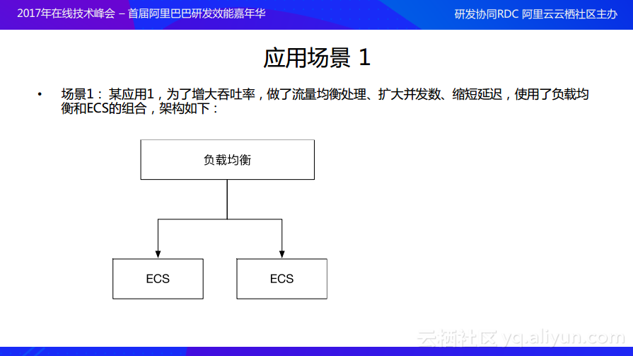

Terraform
===


<!-- TOC -->

- [1. Terraform 是什么？](#1-terraform-是什么)
- [2. Terraform 核心功能](#2-terraform-核心功能)
    - [2.1. 基础架构即代码(Infrastructure as Code)](#21-基础架构即代码infrastructure-as-code)
    - [2.2. 执行计划(Execution Plans)](#22-执行计划execution-plans)
    - [2.3. 资源图(Resource Graph)](#23-资源图resource-graph)
    - [2.4. 自动化变更(Change Automation)](#24-自动化变更change-automation)
- [3. Terraform 如何运作](#3-terraform-如何运作)
    - [3.1. 代码](#31-代码)
    - [3.2. 模块](#32-模块)
    - [3.3. 模块注册表](#33-模块注册表)
    - [3.4. 丰富的REST API](#34-丰富的rest-api)
- [4. Terraform 使用案例](#4-terraform-使用案例)
    - [4.1. Heroku应用程序设置](#41-heroku应用程序设置)
    - [4.2. 多层应用](#42-多层应用)
    - [4.3. 自服务集群 (Self-Service Clusters)](#43-自服务集群-self-service-clusters)
    - [4.4. 软件演示](#44-软件演示)
    - [4.5. 一次性环境](#45-一次性环境)
    - [4.6. 软件定义网络](#46-软件定义网络)
    - [4.7. 资源调度程序](#47-资源调度程序)
    - [4.8. 多云部署](#48-多云部署)
- [5. Terraform与其他工具对比](#5-terraform与其他工具对比)
    - [5.1. Chef，Puppet等](#51-chefpuppet等)
    - [5.2. CloudFormation, Heat等](#52-cloudformation-heat等)
    - [5.3. Boto，Fogd等](#53-botofogd等)
    - [5.4. 自定义解决方案](#54-自定义解决方案)
- [6. Terraform 入门指南](#6-terraform-入门指南)
    - [6.1. 安装Terraform](#61-安装terraform)
    - [6.2. 创建基础设施](#62-创建基础设施)
        - [6.2.1. 配置](#621-配置)
        - [6.2.2. 安装](#622-安装)
        - [6.2.3. 执行](#623-执行)
        - [6.2.4. 供应](#624-供应)
    - [6.3. 修改基础设施](#63-修改基础设施)
        - [6.3.1. 配置](#631-配置)
        - [6.3.2. 执行](#632-执行)
    - [6.4. 销毁基础设施](#64-销毁基础设施)
        - [6.4.1. 销毁](#641-销毁)
    - [6.5. 资源依赖性](#65-资源依赖性)
        - [6.5.1. 分配弹性IP](#651-分配弹性ip)
        - [6.5.2. 应用更改](#652-应用更改)
        - [6.5.3. 隐式和显式依赖关系](#653-隐式和显式依赖关系)
        - [6.5.4. 非依赖资源](#654-非依赖资源)
    - [6.6. 规定](#66-规定)
        - [6.6.1. 定义供应商](#661-定义供应商)
        - [6.6.2. 运行供应商](#662-运行供应商)
        - [6.6.3. 失败的供应商和受污染的资源](#663-失败的供应商和受污染的资源)
        - [6.6.4. 摧毁供应商](#664-摧毁供应商)
    - [6.7. 输入变量](#67-输入变量)
        - [6.7.1. 定义变量](#671-定义变量)
        - [6.7.2. 在配置中使用变量](#672-在配置中使用变量)
        - [6.7.3. 分配变量](#673-分配变量)
            - [6.7.3.1. 命令行标志](#6731-命令行标志)
            - [6.7.3.2. 来自文件](#6732-来自文件)
            - [6.7.3.3. 来自环境变量](#6733-来自环境变量)
            - [6.7.3.4. UI输入](#6734-ui输入)
            - [6.7.3.5. 变量默认值](#6735-变量默认值)
        - [6.7.4. 列表](#674-列表)
        - [6.7.5. 映射](#675-映射)
        - [6.7.6. 分配映射](#676-分配映射)
    - [6.8. 输出变量](#68-输出变量)
        - [6.8.1. 定义输出](#681-定义输出)
        - [6.8.2. 查看输出](#682-查看输出)
    - [6.9. 模块](#69-模块)
        - [6.9.1. 使用模块](#691-使用模块)
        - [6.9.2. 应用更改](#692-应用更改)
        - [6.9.3. 模块输出](#693-模块输出)
        - [6.9.4. 销毁](#694-销毁)
- [Terraform/Ansible on Cloud--基础设施和应用管理实践](#terraformansible-on-cloud--基础设施和应用管理实践)
    - [什么是IaC？](#什么是iac)
    - [Terraform介绍](#terraform介绍)
        - [Terraform安装](#terraform安装)
        - [Terraform模板](#terraform模板)
        - [Terraform使用](#terraform使用)
        - [资源拓扑映射](#资源拓扑映射)
    - [Ansible介绍](#ansible介绍)
        - [Ansible安装](#ansible安装)
        - [Ansible模板](#ansible模板)
        - [Ansible环境搭建以及应用部署](#ansible环境搭建以及应用部署)
    - [Terraform和Ansible的对比和结合](#terraform和ansible的对比和结合)
        - [Terraform和Ansible的对比](#terraform和ansible的对比)
        - [Terraform和Ansible的结合](#terraform和ansible的结合)
    - [操作演示](#操作演示)
    - [自动化能自动化的一切](#自动化能自动化的一切)
    - [参考](#参考)

<!-- /TOC -->

# 1. Terraform 是什么？

Terraform 是一种安全有效地构建、更改和版本控制基础设施的工具(基础架构自动化的编排工具)。它的目标是 "Write, Plan, and create Infrastructure as Code", 基础架构即代码。Terraform 几乎可以支持所有市面上能见到的云服务。具体的说就是可以用代码来管理维护 IT 资源，把之前需要手动操作的一部分任务通过程序来自动化的完成，这样的做的结果非常明显：高效、不易出错。

Terraform 提供了对资源和提供者的灵活抽象。该模型允许表示从物理硬件、虚拟机和容器到电子邮件和 DNS 提供者的所有内容。由于这种灵活性，Terraform 可以用来解决许多不同的问题。这意味着有许多现有的工具与Terraform 的功能重叠。但是需要注意的是，Terraform 与其他系统并不相互排斥。它可以用于管理小到单个应用程序或达到整个数据中心的不同对象。

Terraform 使用配置文件描述管理的组件(小到单个应用程序，达到整个数据中心)。Terraform 生成一个执行计划，描述它将做什么来达到所需的状态，然后执行它来构建所描述的基础结构。随着配置的变化，Terraform 能够确定发生了什么变化，并创建可应用的增量执行计划。

Terraform 是用 Go 语言开发的开源项目，你可以在 github 上访问到它的源代码。

# 2. Terraform 核心功能

## 2.1. 基础架构即代码(Infrastructure as Code)

基础设施使用高级配置语法进行描述。这可以让你的数据中心蓝图像你其他代码一样进行版本控制和管理。此外基础设施可以被分享和重用。

## 2.2. 执行计划(Execution Plans)

Terraform 有一个 plan 步骤，它生成一个执行计划。执行计划显示了当执行 apply 命令时 Terraform 将做什么。通过 plan 进行提前检查，可以使 Terraform 操作真正的基础结构时避免意外。

## 2.3. 资源图(Resource Graph)

Terraform 构建的所有资源的图表，它能够并行地创建和修改任何没有相互依赖的资源。因此，Terraform 可以高效地构建基础设施，操作人员也可以通过图表深入地解其基础设施中的依赖关系。

## 2.4. 自动化变更(Change Automation) 

把复杂的变更集应用到基础设施中，而无需人工交互。通过前面提到的执行计划和资源图，我们可以确切地知道 Terraform 将会改变什么，以什么顺序改变，从而避免许多可能的人为错误。

# 3. Terraform 如何运作

Terraform Enterprise在基础架构之上提供协作，治理和自助服务工作流，作为来自开源的代码配置。Terraform Enterprise为团队合作构建基础架构提供工作空间，模块和其他强大的构造。运营商可以将基础架构作为代码打包成可重复使用的模块，使开发人员能够以自助服务的方式快速进行配置。同样，作为代码和日志记录的策略使组织能够保护，管理和审核其整个部署。


Terraform允许将基础架构表示为代码。期望的状态以简单的人类可读语言表达。Terraform使用此语言提供更改的执行计划，可以对其进行安全性审核，然后应用于更改。可扩展的提供商允许Terraform管理广泛的资源，包括硬件，IaaS，PaaS和SaaS服务。


## 3.1. 代码

使用简单的人类可读配置语言HashiCorp配置语言（HCL）来定义所需的基础架构资源拓扑。还可以在JSON中定义配置，以进行编程生成和应用程序集成。
```ts
resource "google_compute_instance""server" {
  name         = "server"
  machine_type = "g1-small"
  zone         = "us-centrall-a"
  disk {
    image = "ubuntu-1404-trusty-v20160114e"
  }
}
resource "dnsimple_record""hello" {
  domain = "example.com"
  name   = "server"
  value  = "${google_compute_instance.server.network_interface.0.address}"
}
```

## 3.2. 模块

封装资源组以创建可重用的基础结构块。模块允许用户指定可变输入和消耗基础设施，而无需细节方面的专家。
```ts
module "vpc" {
  source = "terraform-aws-modules/vpc/aws"
  name = "my-vpc"
  cidr = "10.0.0.0/16"
  azs             = ["eu-west-1a", "eu-west-1b", "eu-west-1c"]
  private_subnets = ["10.0.1.0/24", "10.0.2.0/24", "10.0.3.0/24"]
  public_subnets  = ["10.0.101.0/24", "10.0.102.0/24", "10.0.103.0/24"]
  enable_nat_gateway = true
  enable_vpn_gateway = true
  tags = {
    Terraform = "true"
    Environment = "dev"
  }
}
```

## 3.3. 模块注册表

来自合作伙伴，贡献者和HashiCorp的社区模块库。自定义模块的私有注册表，经过版权，验证和批准供组织内部使用。


## 3.4. 丰富的REST API

利用Terraform API将配置工作流程集成到现有的CI / CD管道或自定义自动化工具中。


# 4. Terraform 使用案例

当前页面列出了Terraform的一些实际使用案例，实际的用例比我们讲到的要多很多。由于其原生扩展性，可以增加provider和provisioner来进一步扩展Terraform操作资源的能力。

## 4.1. Heroku应用程序设置

Heroku是个流行的托管web应用的PaaS平台。开发者们创建一个应用程序，然后追加附件组件，如：数据库或邮件供应商等。最好的特性之一就是可以动态调整 dynos 和 workers 的数量。但是，但多数普通应用会很快需要许多附加组件和外部服务。

Terraform可以用来代码化 HeroKu 应用需要的一些配置，以确保所有所需组件可用，但是它可以更进一步做到：配置DNSSimple设置一个 CNAME，或为应用配置一个 CloudFare CDN。最妙的是，Terraform可以在不借助Web界面的前提下在30秒以内完成所有工作。

## 4.2. 多层应用

多层架构一个非常常见的模式。大多数两层架构是使用数据库层的web服务器集群。增加其他层用于API服务器，缓存服务器，路由网格等。使用该模式是因为每一层可以独立伸缩，并为关注点进行隔离。

Terraform是一个构建和管理基础设施的完美工具。每一层都可以被描述为一个资源集，并且每层间的依赖关系都会被自动处理；Terraform会在web服务器启动前确保数据库服务器已经可用并且负载均衡可以感知后端web节点。每一层通过只修改配置文件的计数值，使用Terraform可以很容易实现伸缩。因为创建和配置资源被代码化和自动化了，所以，随负载弹性伸缩变得不再重要。

## 4.3. 自服务集群 (Self-Service Clusters)

在一定的组织规模下，管理一个大型且在增长的基础设施对于集中式运维团队而言变得非常有挑战性。取而代之的是变为创建自服务的基础设施，允许产品团队使用集中运维团队提供的工具管理他们自己的基础设施。

使用Terraform，如何构建和伸缩一个服务的知识可以被代码化为一个配置文件。Terraform配置文件可以在组织内分享传播，使客户团队可以像黑盒一样使用配置文件，并且使用Terraform作为工具来管理服务。

## 4.4. 软件演示

现代软件越来越向网络化和分布式发展。尽管又像Vagrant这样的工具构建虚拟环境用于演示，在与生产环境更接近的真实基础设施做演示依然充满挑战。

软件开发这可以提供一个terraform配置文件来在类似AWS的云平台上创建，配置，引导一个演示环境。这使最终用户很容易在他们自己的基础设施上演示软件，设置可以调整参数像集群数量以更加严格的测试任意规模的工具。

## 4.5. 一次性环境

同时有production和staging或QA环境是常用的实践。这些环境是生产环境副本的缩小版克隆，用于在正式环境发布新应用前的测试。随着生产环境增长，也越来越复杂，维护一个最新版staging环境的工作也日益繁重。

使用Terraform，生产环境可以被代码化，然后共享给staging, QA 或 dev。这些环境可以被用于快速启动新环境进行测试，也很容易被销毁。Terraform可以帮助驯服平行环境的复杂性，使弹性创建和销毁变得可行。

## 4.6. 软件定义网络

软件定义网络（SDN）在数据中心中变得越来越受欢迎，因为它为运维和开发提供了更多控制并使网络更好的支持运行于上层的应用。大多数SDN的实现有一个控制层和一个基础设施层。

Terraform可以用于软件定义网络的代码化配置。这些配置以后可以使用Terraform自动配置和代码化代码化控制层接口。这使得配置可以版本化和自动变更。比如：AWS VPC是最常见的软件定义网络之一，且可以使用Terraform配置。

## 4.7. 资源调度程序

一个大型基础架构下，为应用静态分配机器变得越来越具有挑战性。为了解决该问题，涌现了大量像 Borg, Mesos, YARN, 和 Kubernetes的调度器。他们可以用来动态调度Docker容器，Hadoop，Spark和许多其他软件工具。

Terraform并不局限于像AWS这样的物理 provider。资源调度器可以被认为是一个provider，Terraform能够向他们请求资源。这使Terraform可以用于多层：配置物理基础设施，运行调度器以及配置调度器网格。

## 4.8. 多云部署

跨云扩展基础设施依提升容错能力通常很有吸引力。只用一个可用区或一家云提供商，容错能力往往受限于该提供商的能力。拥有多云部署可以更优雅的恢复某宕掉的可用区甚至整个云平台。很明显多云部署很有挑战，因为目前已有的针对基础设施管理的工具都是针对特定云平台的。Terraform不限定某个云平台，允许一个配置文件用于管理多个云提供商甚至可以处理跨云依赖。它简化了管理和编排，可帮助运维构建大型多云基础设施。


# 5. Terraform与其他工具对比

Terraform 提供了一个资源和服务商的灵活的抽象层。该模型允许可以表示从物理硬件，虚拟机和容器到邮件和DNS提供商的所有信息。因为灵活性，Terraform 可以被用于解决许多不同的问题。这意味着许多已存在的工具与Terraform功能重叠。我们对比了Terraform和大量此类工具，但是需要注意到Terraform与其他系统并不是互斥的。它可以被用来管理单个应用程序或整个数据中心。

## 5.1. Chef，Puppet等

配置管理工具在已存在的机器上安装和管理软件。Terraform不是一个配置管理工具，并且它允许现有的工具专注于自己的优势：引导和初始化资源。

使用provisioners，在资源被创建以后，Terraform可以使任意配置管理工具可以被用于配置和初始化资源。Terraform专注于数据中心和相关服务的更高层次的抽象，而不牺牲配置管理工具来做他们最擅长事情的能力。它也拥抱这些工具所负责的成功编排，使整个基础设施的部署简单可靠。

## 5.2. CloudFormation, Heat等

像 CloudFormation, Heat这样的工具。允许将基础设施的细节编写为配置文件。配置文件允许基础设施被弹性创建，修改和销毁。Terraform 受其所解决问题的启发。

Terraform同样使用配置文件配置基础设施细节，但是它更进一步与云平台无关并且能够结合多provider和多服务编排。例如：Terraform可以同时编排AWS和OpenStack集群，开启第三方provider像Cloudflare和DNSimple集成CDN和DNS服务。这使Terraform可以利用其支持的服务来表现和管理整个基础设施，而不是仅仅已存在于单个provider里的子集。它提供一种统一的语法，而不是需要运维为每个平台和服务使用独立且不可相互交互的工具。

Terraform通过使用执行计划的概念将计划语法和执行阶段分开。通过执行terraform plan，更新当前状态并查询配置文件生成新的执行计划。该计划包含所有将要被执行的动作：将被创建，销毁和变更的资源。运维可以检查其状态以确保其符合预期。使用terraform graph，该计划将被可视化并按顺序输其出依赖关系。一旦计划被获取，执行语法会被限制在计划中的动作内。其他工具将计划和执行阶段结合在一起，这意味着运维人员被迫在心里推断变更带来的影响，这在一个大型基础架构中会很快变得难以追溯。Terraform让运维人员有信心应用变更，因为他们事前可以确切知道将会发生什么。

## 5.3. Boto，Fogd等
像Boto, Fog这样的库，被用于原生访问云提供商和服务所提供的API。一些库强制专注于特定的云，有些则尝试打通所有的云并隐藏于以上的不同。使用客户端工具仅提供对于API的低级访问，需要应用程序开发者创建他们自己的工具来构建和管理他们的基础设施。

Terraform不打算提供对于提供商的低级编程访问，而已提供一个高级语法来描述云资源和服务如何被创建，制备和结合。Terraform非常灵活，使用一个基于插件的模型支持providers和provisioners，赋予它支持几乎所有服务API的能力。

## 5.4. 自定义解决方案

Terraform的设计旨在解决这些挑战。它提供了一个简单，统一的语法，允许管理几乎任意资源而不需要学习一个新工具。通过捕获所有资源，他们之间的依赖关系可以被自动解决，所以运维人员不需要记住和推理。消除构建工具的负担使运维人员专注于他们的基础设施而不是工具。

此外，Terraform是一款开源工具。除了HashiCorp公司，Terraform社区也在帮助扩展它的功能，修复bug，完善文档和使用案例。Terraform帮助解决每个组织都存在的一个问题并提供一种适用的标准以避免不同组织间重复造轮子。它的开源特性确保它可以长远发展。


# 6. Terraform 入门指南

## 6.1. 安装Terraform

Terraform为所有平台和架构发布的版本为二进制包。

在这个页面 https://www.terraform.io/downloads.html 中，找到与你系统匹配的软件包然后下载。

采用下面的命令进行安装：
```
wget https://releases.hashicorp.com/terraform/0.12.3/terraform_0.12.3_linux_amd64.zip
yum install unzip -y
unzip terraform_0.12.3_linux_amd64.zip
mv terraform /usr/local/bin/
terraform --version
Terraform v0.12.3
```


## 6.2. 创建基础设施

Terraform安装完成以后，我们直接开始创建一些基础设施。

这里，在AWS上创建一些基础设施来开始入门指南，因为它最流行且通常可以被理解，但是Terraform可以管理许多provider，包含在单个配置文件中管理多个provider。

如果你没有AWS账号，就创建一个。在入门指南中，我们将只会用AWS免费试用的资源，也就是说它是免费的。如果你已经有一个AWS账号，你可能要充一些钱，但是最多不会超过几美元。

> 警告！如果你使用的不是一个AWS免费试用账号，你可能需要充值来执行这些例子。你最多需要充值几美元，但是我们不对任何可能产生的费用负责。

### 6.2.1. 配置

Terraform中用来描述基础设施的的文件被叫做Terraform配置文件。现在我们将写下我们第一个配置文件来启动一个AWS的EC2实例。

> Configuration Language https://www.terraform.io/docs/configuration/index.html

整个配置文件内容如下所示。我们将在随后的每一步逐步讲解。将下面内容保存到一个名为example.tf的文件中。确认在你的目录中没有其他*.tf文件，因为Terraform将加载所有的*.tf文件。
```
provider "aws" {
  access_key = "ACCESS_KEY_HERE"
  secret_key = "SECRET_KEY_HERE"
  region     = "us-east-1"
}

resource "aws_instance" "example" {
  ami           = "ami-2757f631"
  instance_type = "t2.micro"
}
```

> 注意：上面的配置工作于大部分AWS账户，将访问默认VPC。EC2经典网络用户请为instance_type指定t1.micro，并为ami指定ami-408c7f28。如果你使用一个非us-east-1的region你将需要指定该region的ami因为每个region的ami都是特定的。

用你的access key和secret key替换ACCESS_KEY_HERE和SECRET_KEY_HERE。我们现在将他们硬编码，但是在入门指南后面的将会将他们提取到变量里。

> 注意：如果你仅仅遗漏了AWS凭证，Terraform将自动从已保存的API凭证中搜索（如：在~/.aws/credentials中）。或者IAM实例配置文件凭据。对于将文件签入源代码管理或者有多个管理员的情况，该选择要干净很多。到这里查看细节。将凭据信息遗留到配置文件以外，使你可以将凭据信息放在源代码管理之外，并且也可以为不同的用户使用不同的IAM凭据而不需要修改配置文件。

这是一个完整的可执行的Terraform配置文件。一般结构应该直观并且直接。

`provider`块用于指定provider名称，在我们的实例中叫"aws"。provider负责创建和管理资源。如果一个Terraform配置文件由多个provider组成，可以有多个provider块，这是常见的情况。

`resource`块定一个基础设施中存在的资源。一个资源可能是物理组件，如：EC2实例，或也可以是一个逻辑资源比如Heroku应用。

resource块开始前有两个字符串：资源类型和资源名称。在我们的实例中资源类型是"aws_instance"，资源名为"example"。资源类型的前缀映射到provider。在我们的实例中，"aws_instance"自动告知你Terraform被"aws"provider管理。

resource块内部是该资源的配置。它独立于每个资源provider并且在provider参考完全列出来。对于我们的EC2实例，我们为ubuntu指定一个AMI，然后请求一个"t2.micro"的实例因为我们有免费资格。

### 6.2.2. 安装

为一个新配置文件或从版本控制工具中检出的已存在的配置执行的第一个命令是`terraform init`，它将初始化各种本地配置和数据为后面的命令使用。

Terraform使用基于插件的结构来支持众多的基础设施和服务提供商。从Terraform"0.10.0"起，每个提供商有他们自己封装和发型的二进制文件，从Terraform分离出来。terraform init将自动为下载配置文件中包含provider下载插件。在该实例中只包含"aws"插件。

```
$ terraform init
Initializing the backend...

Initializing provider plugins...
- Checking for available provider plugins...
- Downloading plugin for provider "aws" (terraform-providers/aws) 2.10.0...

The following providers do not have any version constraints in configuration,
so the latest version was installed.

To prevent automatic upgrades to new major versions that may contain breaking
changes, it is recommended to add version = "..." constraints to the
corresponding provider blocks in configuration, with the constraint strings
suggested below.

* provider.aws: version = "~> 2.10"

Terraform has been successfully initialized!

You may now begin working with Terraform. Try running "terraform plan" to see
any changes that are required for your infrastructure. All Terraform commands
should now work.

If you ever set or change modules or backend configuration for Terraform,
rerun this command to reinitialize your working directory. If you forget, other
commands will detect it and remind you to do so if necessary.
```

`aws` provider插件与其他薄记文件一起被下载安装到当前目录子目录。

输出信息会显示所安装插件的版本，以及建议在配置文件中指定版本以确保`terraform init`在未来安装一个兼容的版本。对于后面步骤来说这一步不是必须的，因为该配置文件后面将会被废弃。

### 6.2.3. 执行

注意：本指南中列出的命令适用于terraform0.11及以上版本。更早版本需要在应用前使用terraform plan命令查看执行计划。使用terraform version命令确认你当前terraform版本。
在当前目录中你创建的example.tf为例，执行terraform apply。你将看到以下类似输出，我们删节了部分输出以节省空间：
```
$ terraform apply
# ...

An execution plan has been generated and is shown below.
Resource actions are indicated with the following symbols:
  + create

Terraform will perform the following actions:

  # aws_instance.example will be created
  + resource "aws_instance" "example" {
      + ami                          = "ami-2757f631"
      + arn                          = (known after apply)
      + associate_public_ip_address  = (known after apply)
      + availability_zone            = (known after apply)
      + cpu_core_count               = (known after apply)
      + cpu_threads_per_core         = (known after apply)
      + get_password_data            = false
      + host_id                      = (known after apply)
      + id                           = (known after apply)
      + instance_state               = (known after apply)
      + instance_type                = "t2.micro"
      + ipv6_address_count           = (known after apply)
      + ipv6_addresses               = (known after apply)
      + key_name                     = (known after apply)
      + network_interface_id         = (known after apply)
      + password_data                = (known after apply)
      + placement_group              = (known after apply)
      + primary_network_interface_id = (known after apply)
      + private_dns                  = (known after apply)
      + private_ip                   = (known after apply)
      + public_dns                   = (known after apply)
      + public_ip                    = (known after apply)
      + security_groups              = (known after apply)
      + source_dest_check            = true
      + subnet_id                    = (known after apply)
      + tenancy                      = (known after apply)
      + volume_tags                  = (known after apply)
      + vpc_security_group_ids       = (known after apply)

      + ebs_block_device {
          + delete_on_termination = (known after apply)
          + device_name           = (known after apply)
          + encrypted             = (known after apply)
          + iops                  = (known after apply)
          + snapshot_id           = (known after apply)
          + volume_id             = (known after apply)
          + volume_size           = (known after apply)
          + volume_type           = (known after apply)
        }

      + ephemeral_block_device {
          + device_name  = (known after apply)
          + no_device    = (known after apply)
          + virtual_name = (known after apply)
        }

      + network_interface {
          + delete_on_termination = (known after apply)
          + device_index          = (known after apply)
          + network_interface_id  = (known after apply)
        }

      + root_block_device {
          + delete_on_termination = (known after apply)
          + iops                  = (known after apply)
          + volume_id             = (known after apply)
          + volume_size           = (known after apply)
          + volume_type           = (known after apply)
        }
    }

Plan: 1 to add, 0 to change, 0 to destroy.
```
该输出显示执行计划，描述terraform将根据配置文件执行那些动作来改变基础设施。输出格式与工具输出的diff产生的格式类似，比如git。输出内容在 aws_instance.example 有个 + 意味着Terraform将会创建该资源。在那些之下，显示将会被设置的属性。当值为(known after apply)时，意味着资源被创建后才能知道。

`terraform apply`执行失败报错时，读取错误信息并修复所报错误。在这一步，它可能是配置文件中的语法错误。

如果计划被成功创建，Terraform将在执行前暂停并等待确认。如果计划中有任何不对或危险信息，在这里终止很安全，它不会对你的基础设施做任何改变。这是如果计划看起来可接受，在确认终端输入yes执行。

执行该计划会花几分钟时间，直到EC2实例可用：
```
# ...
aws_instance.example: Creating...
aws_instance.example: Still creating... [10s elapsed]
aws_instance.example: Creation complete after 1m50s [id=i-0bbf06244e44211d1]

Apply complete! Resources: 1 added, 0 changed, 0 destroyed.
```

在此之后Terraform执行完成，你可以到EC2终端查看创建号的EC2实例。

Terraform也会写一些数据到terraform.tfstate。该状态文件极其重要；它追踪创建的资源ID，所以Terraform知道它管理的是什么资源。该文件必须被保存并分发给可能使用terraform的任何人。通常建议在使用Terraform时设置远程状态，来自动分享状态，但是针对像入门指南这样简单的环境这不是必须的。

你可以使用terraform show检查当前状态：
```
$ terraform show
# aws_instance.example:
resource "aws_instance" "example" {
    ami                          = "ami-2757f631"
    arn                          = "arn:aws:ec2:us-east-1:130490850807:instance/i-0bbf06244e44211d1"
    associate_public_ip_address  = true
    availability_zone            = "us-east-1c"
    cpu_core_count               = 1
    cpu_threads_per_core         = 1
    disable_api_termination      = false
    ebs_optimized                = false
    get_password_data            = false
    id                           = "i-0bbf06244e44211d1"
    instance_state               = "running"
    instance_type                = "t2.micro"
    ipv6_address_count           = 0
    ipv6_addresses               = []
    monitoring                   = false
    primary_network_interface_id = "eni-0f1ce5bdae258b015"
    private_dns                  = "ip-172-31-61-141.ec2.internal"
    private_ip                   = "172.31.61.141"
    public_dns                   = "ec2-54-166-19-244.compute-1.amazonaws.com"
    public_ip                    = "54.166.19.244"
    security_groups              = [
        "default",
    ]
    source_dest_check            = true
    subnet_id                    = "subnet-1facdf35"
    tenancy                      = "default"
    volume_tags                  = {}
    vpc_security_group_ids       = [
        "sg-5255f429",
    ]

    credit_specification {
        cpu_credits = "standard"
    }

    root_block_device {
        delete_on_termination = true
        iops                  = 100
        volume_id             = "vol-0079e485d9e28a8e5"
        volume_size           = 8
        volume_type           = "gp2"
    }
}
```
你可以看到，通过创建资源，我们收集了很多信息。这些值可以被引用以配置其他资源和输出，这些将会在入门指南后面的部分讲到。

### 6.2.4. 供应
我们此时推出的EC2实例基于给定的AMI，但没有安装其他软件。 如果您正在运行基于图像的基础架构（可能使用Packer创建映像），那么这就是您所需要的。

但是，许多基础结构仍然需要某种初始化或软件供应步骤。 Terraform支持配置程序，为了做到这一点，我们将在稍后的入门指南中介绍它们。


## 6.3. 修改基础设施

基础设施在持续发展，Terraform的创建就是为了管理和实施这些变更。当你修改配置文件时，Terraform构建一个变更必要的执行计划来达到你的期望状态。

使用Terraform变更基础设施，你不仅可以版本控制你的配置也可以版本控制你的状态，所以你可以看到你的基础设施时如何随着时间发展变化。

### 6.3.1. 配置

让我们修改实例的ami。在你的配置文件中编辑 aws_instance.example资源，将它改成如下所示：
```
resource "aws_instance" "example" {
  ami           = "ami-b374d5a5"
  instance_type = "t2.micro"
}
```

> 注意：EC2经典用户请使用 ami-656be372 AMI 和 t1.micro类型。

我们将AMI从Ubuntu 16.04 LTS改成了Ubuntu 16.10。Terraform配置意味着做如此变更。你也可以删除该资源，Terraform知道将要销毁老资源。

### 6.3.2. 执行

改完配置以后，再次执行 terraform apply来查看Terraform将如何应用该变更到当前资源。

```
$ terraform apply
aws_instance.example: Refreshing state... [id=i-0bbf06244e44211d1]

An execution plan has been generated and is shown below.
Resource actions are indicated with the following symbols:
-/+ destroy and then create replacement

Terraform will perform the following actions:

  # aws_instance.example must be replaced
-/+ resource "aws_instance" "example" {
      ~ ami                          = "ami-2757f631" -> "ami-b374d5a5" # forces replacement
      ~ arn                          = "arn:aws:ec2:us-east-1:130490850807:instance/i-0bbf06244e44211d1" -> (known after apply)
      ~ associate_public_ip_address  = true -> (known after apply)
      ~ availability_zone            = "us-east-1c" -> (known after apply)
      ~ cpu_core_count               = 1 -> (known after apply)
      ~ cpu_threads_per_core         = 1 -> (known after apply)
      - disable_api_termination      = false -> null
      - ebs_optimized                = false -> null
        get_password_data            = false
      + host_id                      = (known after apply)
      ~ id                           = "i-0bbf06244e44211d1" -> (known after apply)
      ~ instance_state               = "running" -> (known after apply)
        instance_type                = "t2.micro"
      ~ ipv6_address_count           = 0 -> (known after apply)
      ~ ipv6_addresses               = [] -> (known after apply)
      + key_name                     = (known after apply)
      - monitoring                   = false -> null
      + network_interface_id         = (known after apply)
      + password_data                = (known after apply)
      + placement_group              = (known after apply)
      ~ primary_network_interface_id = "eni-0f1ce5bdae258b015" -> (known after apply)
      ~ private_dns                  = "ip-172-31-61-141.ec2.internal" -> (known after apply)
      ~ private_ip                   = "172.31.61.141" -> (known after apply)
      ~ public_dns                   = "ec2-54-166-19-244.compute-1.amazonaws.com" -> (known after apply)
      ~ public_ip                    = "54.166.19.244" -> (known after apply)
      ~ security_groups              = [
          - "default",
        ] -> (known after apply)
        source_dest_check            = true
      ~ subnet_id                    = "subnet-1facdf35" -> (known after apply)
      ~ tenancy                      = "default" -> (known after apply)
      ~ volume_tags                  = {} -> (known after apply)
      ~ vpc_security_group_ids       = [
          - "sg-5255f429",
        ] -> (known after apply)

      - credit_specification {
          - cpu_credits = "standard" -> null
        }

      + ebs_block_device {
          + delete_on_termination = (known after apply)
          + device_name           = (known after apply)
          + encrypted             = (known after apply)
          + iops                  = (known after apply)
          + snapshot_id           = (known after apply)
          + volume_id             = (known after apply)
          + volume_size           = (known after apply)
          + volume_type           = (known after apply)
        }

      + ephemeral_block_device {
          + device_name  = (known after apply)
          + no_device    = (known after apply)
          + virtual_name = (known after apply)
        }

      + network_interface {
          + delete_on_termination = (known after apply)
          + device_index          = (known after apply)
          + network_interface_id  = (known after apply)
        }

      ~ root_block_device {
          ~ delete_on_termination = true -> (known after apply)
          ~ iops                  = 100 -> (known after apply)
          ~ volume_id             = "vol-0079e485d9e28a8e5" -> (known after apply)
          ~ volume_size           = 8 -> (known after apply)
          ~ volume_type           = "gp2" -> (known after apply)
        }
    }

Plan: 1 to add, 0 to change, 1 to destroy.
```

前缀 `-/+` 表示Terraform将销毁并重新创建资源，而不是就地更新资源。 虽然某些属性可以就地更新（使用~前缀显示），但更改EC2实例的AMI需要重新创建它。 Terraform为您处理这些细节，执行计划明确了Terraform将做什么。

此外，执行计划显示AMI更改是需要替换资源的内容。 使用此信息，您可以调整更改，以避免在某些情况下不接受销毁/创建更新。

在继续之前，Terraform再次提示批准执行计划。 回答是执行计划的步骤：

```
aws_instance.example: Destroying... [id=i-0bbf06244e44211d1]
aws_instance.example: Still destroying... [id=i-0bbf06244e44211d1, 10s elapsed]
aws_instance.example: Still destroying... [id=i-0bbf06244e44211d1, 20s elapsed]
aws_instance.example: Still destroying... [id=i-0bbf06244e44211d1, 30s elapsed]
aws_instance.example: Destruction complete after 31s
aws_instance.example: Creating...
aws_instance.example: Still creating... [10s elapsed]
aws_instance.example: Still creating... [20s elapsed]
aws_instance.example: Still creating... [30s elapsed]
aws_instance.example: Creation complete after 38s [id=i-0589469dd150b453b]

Apply complete! Resources: 1 added, 0 changed, 1 destroyed.
```

正如执行计划所示，Terraform首先销毁现有实例，然后在其位置创建一个新实例。 您可以再次使用`terraform show`来查看与此实例关联的新值。

## 6.4. 销毁基础设施

在生产环境销毁基础设施是罕见的时间。但是如果你使用Terraform启动多个环境，比如：开发，测试，QA环境等，那么销毁是个非常有用的操作。

### 6.4.1. 销毁

与terraform apply命令类似，资源可以用`terraform destroy`命令销毁掉，但是它的行为就好像所有的资源都从配置中删除了一样。

```
# ...
#aws_instance.example will be destroyed
  - resource "aws_instance" "example" {
      - ami                          = "ami-b374d5a5" -> null
# ...
```

`-` 前缀说明该实例将被销毁。像apply一样，Terraform输出其执行计划并在执行变更前等待确认。

输入yes以执行该计划并销毁基础设施：

```
# ...
aws_instance.example: Destroying... [id=i-0589469dd150b453b]

Destroy complete! Resources: 1 destroyed.
# ...
```

像apply一样，Terraform决定了必须被销毁的资源的顺序。当前示例中只有一个实例，所以不需要顺序。在更多有更多资源的复杂场景中，Terraform将按合适的顺序销毁它们以遵循以来关系，我们将在本指南最后看到这一点。


## 6.5. 资源依赖性

在这个页面中，我们将介绍资源依赖性，我们不仅会首次看到具有多个资源的配置，还会看到资源参数使用来自其他资源的信息的情况。

到目前为止，我们的示例只包含一个资源。真实的基础设施拥有各种各样的资源和资源类型。Terraform配置可以包含多个资源，多种资源类型，这些类型甚至可以跨多个提供者。

在此页面上，我们将展示多个资源的基本示例以及如何引用其他资源的属性来配置后续资源。

### 6.5.1. 分配弹性IP

我们将通过为我们正在管理的EC2实例分配弹性IP来改进我们的配置。修改您的example.tf并添加以下内容：
```
resource "aws_eip" "ip" {
  instance = aws_instance.example.id
}
```
这应该从添加EC2实例资源的早期示例中看起来很熟悉，除非这次我们正在构建“aws_eip”资源类型。此资源类型将弹性IP分配并关联 到EC2实例。

aws_eip的唯一参数 是“instance”，它是分配IP的EC2实例。对于此值，我们使用插值来使用我们之前管理的EC2实例中的属性。

此插值的语法应该很简单：它从“aws_instance.example”资源请求“id”属性。

### 6.5.2. 应用更改

运行terraform apply以查看Terraform计划如何应用此更改。输出类似于以下内容：

```
$ terraform apply
# ...

  # aws_eip.ip will be created
  + resource "aws_eip" "ip" {
      + allocation_id     = (known after apply)
      + association_id    = (known after apply)
      + domain            = (known after apply)
      + id                = (known after apply)
      + instance          = (known after apply)
      + network_interface = (known after apply)
      + private_dns       = (known after apply)
      + private_ip        = (known after apply)
      + public_dns        = (known after apply)
      + public_ip         = (known after apply)
      + public_ipv4_pool  = (known after apply)
      + vpc               = (known after apply)
    }

  # aws_instance.example will be created
  + resource "aws_instance" "example" {
      + ami                          = "ami-b374d5a5"
# ...
```

Terraform将创建两个资源：实例和弹性IP。在“aws_eip”的“instance”值中，您可以看到原始插值仍然存在。这是因为在创建“aws_instance”之前，不会知道此变量。它将在申请时更换。

像往常一样，Terraform会在进行任何更改之前提示确认。yes申请答案。继续输出将类似于以下内容：

```
# ...
aws_instance.example: Creating...
aws_instance.example: Creation complete after 36s [id=i-0214dc13c9f74e01b]
aws_eip.ip: Creating...
aws_eip.ip: Creation complete after 2s [id=eipalloc-007abcd5e15792497]

Apply complete! Resources: 2 added, 0 changed, 0 destroyed.
```

如上所示，Terraform在创建弹性IP地址之前创建了EC2实例。由于插值表达式将EC2实例的ID传递给弹性IP地址，Terraform能够推断出依赖关系，并且知道它必须首先创建实例。

### 6.5.3. 隐式和显式依赖关系

通过研究插值表达式中使用的资源属性，Terraform可以自动推断出一个资源何时依赖于另一个资源。在上面的示例中，引用aws_instance.example.id创建了对named 的隐式依赖项 aws_instance example 。

Terraform使用此依赖关系信息来确定创建不同资源的正确顺序。在上面的例子中，Terraform知道aws_instance必须在之前创建aws_eip。

通过插值表达式的隐式依赖关系是告知Terraform关于这些关系的主要方式，应尽可能使用。

有时，Terraform 不可见的资源之间存在依赖关系。depends_on任何资源都接受该参数，并接受资源列表以创建显式依赖项。

例如，我们将在EC2实例上运行的应用程序可能需要使用特定的Amazon S3存储桶，但该依赖关系是在应用程序代码中配置的，因此对Terraform不可见。在这种情况下，我们可以使用depends_on显式声明依赖：
```
# New resource for the S3 bucket our application will use.
resource "aws_s3_bucket" "example" {
  # NOTE: S3 bucket names must be unique across _all_ AWS accounts, so
  # this name must be changed before applying this example to avoid naming
  # conflicts.
  bucket = "terraform-getting-started-guide"
  acl    = "private"
}

# 11. Change the aws_instance we declared earlier to now include "depends_on"
resource "aws_instance" "example" {
  ami           = "ami-2757f631"
  instance_type = "t2.micro"

  # Tells Terraform that this EC2 instance must be created only after the
  # S3 bucket has been created.
  depends_on = [aws_s3_bucket.example]
}
```


### 6.5.4. 非依赖资源
我们可以通过添加另一个EC2实例来继续构建此配置：
```
resource "aws_instance" "another" {
  ami           = "ami-b374d5a5"
  instance_type = "t2.micro"
}
```

由于此新实例不依赖于任何其他资源，因此可以与其他资源并行创建。在可能的情况下，Terraform将同时执行操作以减少应用更改所需的总时间。

在继续之前，从配置中删除此新资源并terraform apply再次运行以销毁它。我们不会在入门指南中进一步使用此第二个实例。


## 6.6. 规定

您现在可以创建和修改基础架构。现在让我们看看如何使用配置程序在创建实例时初始化它们。

如果你正在使用基于图像的基础设施（也许是使用Packer创建的图像），那么你到目前为止学到的东西已经足够了。但是，如果您需要在实例上进行一些初始设置，那么配置程序允许您上载文件，运行shell脚本或安装和触发其他软件，如配置管理工具等。

### 6.6.1. 定义供应商

要定义配置程序，请修改定义“示例”EC2实例的资源块，如下所示：
```
resource "aws_instance" "example" {
  ami           = "ami-b374d5a5"
  instance_type = "t2.micro"

  provisioner "local-exec" {
    command = "echo ${aws_instance.example.public_ip} > ip_address.txt"
  }
}
```
这会在provisioner块中添加一个resource块。provisioner可以添加多个 块来定义多个配置步骤。Terraform支持 多个配置程序，但是对于此示例，我们使用的是local-exec配置程序。

该local-exec预配本地执行的机器上运行Terraform的命令。我们正在使用此配置程序而不是其他配置程序，因此我们现在不必担心指定任何 连接信息。

### 6.6.2. 运行供应商

配置程序仅在创建资源时运行。它们不是配置管理的替代品，也不是更改已经运行的服务器的软件，而只是作为引导服务器的一种方式。对于配置管理，您应该使用Terraform配置来调用真实的配置管理解决方案。

确保您的基础架构已经 销毁（如果尚未销毁），然后运行apply：
```
$ terraform apply
# ...

aws_instance.example: Creating...
  ami:           "" => "ami-b374d5a5"
  instance_type: "" => "t2.micro"
aws_eip.ip: Creating...
  instance: "" => "i-213f350a"

Apply complete! Resources: 2 added, 0 changed, 0 destroyed.
```
Terraform将从配置器输出到控制台，但在这种情况下没有输出。但是，我们可以通过查看ip_address.txt文件来验证所有工作：
```
$ cat ip_address.txt
54.192.26.128
```
正如我们所问，它包含IP！

### 6.6.3. 失败的供应商和受污染的资源

如果资源成功创建但在配置期间失败，则Terraform将发生错误并将资源标记为“受污染”。被物理创建的资源已被物理创建，但由于配置失败，因此无法认为是安全的。

当您生成下一个执行计划时，Terraform将不会尝试在同一资源上重新启动配置，因为它不能保证安全。相反，Terraform将删除任何受污染的资源并创建新资源，尝试在创建后再次配置它们。

当故障发生时，Terraform也不会在应用期间自动回滚和销毁资源，因为这会违反执行计划：执行计划会说创建资源，但不会说它将被删除。但是，如果您使用受污染的资源创建执行计划，该计划将明确指出资源将被销毁，因为它已被污染。

### 6.6.4. 摧毁供应商

还可以定义仅在销毁操作期间运行的供应商。这些对于执行系统清理，提取数据等非常有用。

对于许多资源，建议尽可能使用内置清理机制（例如init脚本），但必要时可以使用配置程序。

入门指南不会​​显示任何销毁配置程序示例。如果您需要使用销毁配置程序，请 参阅配置文件。


## 6.7. 输入变量

您现在拥有足够的Terraform知识来创建有用的配置，但我们仍然对访问密钥，AMI等进行硬编码。要真正实现可共享和版本控制，我们需要对配置进行参数化。此页面介绍了输入变量作为执行此操作的方法。

### 6.7.1. 定义变量

让我们首先将访问密钥，密钥和区域提取到几个变量中。variables.tf使用以下内容创建另一个文件。

> 注意：该文件可以命名为任何名称，因为Terraform会加载.tf以目录结尾的所有文件。

```
variable "region" {
  default = "us-east-1"
}
```
这定义了Terraform配置中的三个变量。前两个有空块{}。第三个设置默认值。如果设置了默认值，则该变量是可选的。否则，该变量是必需的。如果您terraform plan现在运行 ，Terraform将提示您输入未设置字符串变量的值。

### 6.7.2. 在配置中使用变量

接下来，使用以下内容替换AWS提供程序配置：
```
provider "aws" {
  region     = var.region
}
```
这使用了更多插值，这次以前缀为前缀var.。这告诉Terraform你正在访问变量。这会使用给定变量配置AWS提供程序。

### 6.7.3. 分配变量

有多种方法可以分配变量。下面也是选择变量值的顺序。以下是考虑变量的优先级降序。

#### 6.7.3.1. 命令行标志

您可以使用-var标志直接在命令行上设置变量 。在该Terraform检查配置的任何命令接受该标志，如apply，plan和refresh：
```
$ terraform apply \
  -var 'region=us-east-2'
# ...
```

再次，以这种方式设置变量将不会保存它们，并且它们必须在执行命令时重复输入。

#### 6.7.3.2. 来自文件

要保留变量值，请创建一个文件并在此文件中分配变量。创建一个terraform.tfvars使用以下内容命名的文件：
```
region = "us-east-2"
```
对于与当前目录匹配terraform.tfvars或*.auto.tfvars存在的所有文件，Terraform会自动加载它们以填充变量。如果文件名称为其他名称，则可以-var-file直接使用该标志指定文件。这些文件与Terraform配置文件的语法相同。和Terraform配置文件一样，这些文件也可以是JSON。

我们不建议将用户名和密码保存到版本控制，但您可以创建本地密钥变量文件并用于-var-file加载它。

您可以-var-file在单个命令中使用多个参数，其中一些参数已签入版本控制，而其他参数未签入。例如：
```
$ terraform apply \
  -var-file="secret.tfvars" \
  -var-file="production.tfvars"
```

#### 6.7.3.3. 来自环境变量

Terraform将以形式读取环境变量，TF_VAR_name 以查找变量的值。例如，TF_VAR_region 可以设置region变量来设置变量。

注意：环境变量只能填充字符串类型变量。必须通过其他机制之一填充列表和映射类型变量。

#### 6.7.3.4. UI输入

如果您terraform apply使用未指定的某些变量执行，Terraform将要求您以交互方式输入其值。这些值不会保存，但这为Terraform入门提供了方便的工作流程。建议不要在日常使用Terraform时使用UI输入。

注意：UI输入仅支持字符串变量。必须通过其他机制之一填充列表和映射变量。

#### 6.7.3.5. 变量默认值

如果没有通过任何这些方法为变量赋值，并且变量default在其声明中有一个键，则该值将用于该变量。


### 6.7.4. 列表

列表是明确或隐式定义的
```
# implicitly by using brackets [...]
variable "cidrs" { default = [] }

# explicitly
variable "cidrs" { type = list }
```
您可以在terraform.tfvars文件中指定列表：
```
cidrs = [ "10.0.0.0/16", "10.1.0.0/16" ]
```

### 6.7.5. 映射

我们用变量替换了敏感字符串，但我们仍然是硬编码AMI。不幸的是，AMI特定于正在使用的区域。一种选择是只要求用户输入该区域的正确AMI，但Terraform可以比使用地图更好 。

映射是一种创建查找表变量的方法。一个例子将证明这一点最好。让我们将AMI提取到地图中，并添加对该us-west-2地区的支持：
```
variable "amis" {
  type = "map"
  default = {
    "us-east-1" = "ami-b374d5a5"
    "us-west-2" = "ami-4b32be2b"
  }
}
```
变量可以具有map显式指定的类型，也可以通过指定作为映射的默认值将其隐式声明为映射。以上说明了两者。

然后，用aws_instance以下内容替换：
```
resource "aws_instance" "example" {
  ami           = var.amis[var.region]
  instance_type = "t2.micro"
}
```
这里使用的方括号索引表示法是一个如何将map类型表达式作为变量访问的示例，其中[var.region]引用了var.amis动态查找的声明。

虽然在此示例中未使用它，但map类型表达式也可以直接使用静态值查找var.amis["us-east-1"]。

### 6.7.6. 分配映射


我们在上面设置了默认值，但也可以使用-var和 -var-file值设置地图。例如：
```
$ terraform apply -var 'amis={ us-east-1 = "foo", us-west-2 = "bar" }'
# ...
```
注意：即使将每个键都指定为输入，也必须通过将其默认值设置为映射来将变量建立为映射{}。

以下是从文件设置地图密钥的示例。从这些变量定义开始：
```
variable "region" {}
variable "amis" {
  type = "map"
}
```
您可以在terraform.tfvars文件中指定密钥：
```
amis = {
  "us-east-1" = "ami-abc123"
  "us-west-2" = "ami-def456"
}
```
并通过资源插值访问它们：
```
output "ami" {
  value = aws_instance.example.ami
}
```
像这样：
```
$ terraform apply -var region=us-west-2

Apply complete! Resources: 0 added, 0 changed, 0 destroyed.

Outputs:

  ami = ami-def456
```

## 6.8. 输出变量

在上一节中，我们引入了输入变量作为参数化Terraform配置的方法。在此页面中，我们引入输出变量作为组织数据的方式，以便轻松查询并显示给Terraform用户。

在构建可能复杂的基础架构时，Terraform会为您的所有资源存储数百或数千个属性值。但作为Terraform的用户，您可能只对一些重要值感兴趣，例如负载均衡器IP，VPN地址等。

输出是告诉Terraform哪些数据很重要的一种方式。apply调用时输出该数据，可以使用该terraform output命令查询。

### 6.8.1. 定义输出

让我们定义一个输出，向我们展示我们创建的弹性IP地址的公共IP地址。将其添加到您的任何 *.tf文件中：
```
output "ip" {
  value = aws_eip.ip.public_ip
}
```
这定义了一个名为“ip”的输出变量。如果要将变量的名称用作其他模块的输入，则该变量的名称必须符合Terraform变量命名约定。该value字段指定值将是什么，并且几乎总是包含一个或多个插值，因为输出数据通常是动态的。在这种情况下，我们输出public_ip弹性IP地址的 属性。

output可以定义多个块以指定多个输出变量。

### 6.8.2. 查看输出

运行terraform apply以填充输出。这只需要在定义输出后完成一次。应用输出应略有变化。最后你应该看到这个：
```
$ terraform apply
...

Apply complete! Resources: 0 added, 0 changed, 0 destroyed.

Outputs:

  ip = 50.17.232.209
```
apply突出了产出。您还可以使用terraform output以下方式在申请时间后查询输出：
```
$ terraform output ip
50.17.232.209
```
此命令对于脚本提取输出很有用。


## 6.9. 模块

> 本指南目前尚未针对Terraform 0.12进行更新。有关更新或编写模块的更多信息，请参阅配置文档:https://www.terraform.io/docs/configuration/modules.html

到目前为止，我们一直在通过直接编辑Terraform配置来配置Terraform。随着我们的基础设施的发展，这种做法存在一些关键问题：缺乏组织，缺乏可重用性以及团队管理困难。

Terraform中的模块是Terraform配置的独立包，可作为一个组进行管理。模块用于创建可重用组件，改进组织，并将基础架构处理为黑盒子。

入门的这一部分将介绍使用模块的基础知识。模块文档中更详细地介绍了编写模块 。

警告！此页面上的例子是不是有资格对 AWS的自由层。除非您愿意花费少量资金，否则请勿尝试此页面上的示例。

### 6.9.1. 使用模块

如果您有任何实例从入门指南中的先前步骤运行，请使用terraform destroy它们销毁它们，并删除所有配置文件。

该Terraform注册包括准备使用的模块，各种常见用途，可作为大型建筑块为基础的目录。

在这个例子中，我们将使用 AWS的Consul Terraform模块，它将建立一个完整的Consul集群。可以通过Terraform Registry站点上的搜索功能找到此模块和其他模块。

使用以下内容创建配置文件：
```
terraform {
  required_version = "0.11.11"
}

provider "aws" {
  access_key = "AWS ACCESS KEY"
  secret_key = "AWS SECRET KEY"
  region     = "us-east-1"
}

module "consul" {
  source      = "hashicorp/consul/aws"
  num_servers = "3"
}
```
该module块以该模块的Terraform Registry页面上给出的示例开始，告诉Terraform创建和管理该模块。这与resource块类似：它具有在此配置中使用的名称 - 在本例中，"consul"- 以及模块的“输入”文档中列出的一组输入值 。

（请注意，provider可以省略该块以支持环境变量。有关 详细信息，请参阅AWS Provider文档。此模块要求您的AWS账户具有默认VPC。）

该source属性是模块的唯一必需参数。它告诉Terraform可以检索模块的位置。Terraform会自动为您下载和管理模块。

在这种情况下，模块从官方Terraform Registry中检索。Terraform还可以从各种来源检索模块，包括私有模块注册表或直接从Git，Mercurial，HTTP和本地文件。

显示的其他属性是我们模块的输入。此模块支持许多其他输入，但所有输入都是可选的，并且具有合理的实验值。

在配置中添加新模块后，必须运行（或重新运行） terraform init以获取并安装新模块的源代码：
```
$ terraform init
# ...
```
默认情况下，此命令不会检查可用的新模块版本，因此可以安全地多次运行。该-upgrade选项还将检查可用的现有模块和提供程序的任何较新版本。

### 6.9.2. 应用更改

通过安装Consul模块（及其依赖项），我们现在可以应用这些更改来创建其中描述的资源。

如果运行terraform apply，您将看到模块中封装的所有资源的大型列表。输出类似于我们在直接使用资源时看到的内容，但资源名称现在的模块路径前缀为其名称，如下例所示：
```
  + module.consul.module.consul_clients.aws_autoscaling_group.autoscaling_group
      id:                                        <computed>
      arn:                                       <computed>
      default_cooldown:                          <computed>
      desired_capacity:                          "6"
      force_delete:                              "false"
      health_check_grace_period:                 "300"
      health_check_type:                         "EC2"
      launch_configuration:                      "${aws_launch_configuration.launch_configuration.name}"
      max_size:                                  "6"
      metrics_granularity:                       "1Minute"
      min_size:                                  "6"
      name:                                      <computed>
      protect_from_scale_in:                     "false"
      tag.#:                                     "2"
      tag.2151078592.key:                        "consul-clients"
      tag.2151078592.propagate_at_launch:        "true"
      tag.2151078592.value:                      "consul-example"
      tag.462896764.key:                         "Name"
      tag.462896764.propagate_at_launch:         "true"
      tag.462896764.value:                       "consul-example-client"
      termination_policies.#:                    "1"
      termination_policies.0:                    "Default"
      vpc_zone_identifier.#:                     "6"
      vpc_zone_identifier.1880739334:            "subnet-5ce4282a"
      vpc_zone_identifier.3458061785:            "subnet-16600f73"
      vpc_zone_identifier.4176925006:            "subnet-485abd10"
      vpc_zone_identifier.4226228233:            "subnet-40a9b86b"
      vpc_zone_identifier.595613151:             "subnet-5131b95d"
      vpc_zone_identifier.765942872:             "subnet-595ae164"
      wait_for_capacity_timeout:                 "10m"
```

module.consul.module.consul_clients上面显示的前缀不仅表示资源来自module "consul"我们编写的块，而且事实上该模块在其中有自己的module "consul_clients"块。可以嵌套模块以将复杂系统分解为可管理的组件。

此模块创建的完整资源集包括自动扩展组，安全组，IAM角色和其他所有资源，这些资源都支持将要创建的Consul集群。

请注意，正如我们上面所警告的那样，此模块创建的资源不符合AWS免费套餐的条件，因此进一步处理会产生一些相关成本。要继续创建Consul集群，请 yes在确认提示符处键入。
```
# ...

module.consul.module.consul_clients.aws_security_group.lc_security_group: Creating...
  description:            "" => "Security group for the consul-example-client launch configuration"
  egress.#:               "" => "<computed>"
  ingress.#:              "" => "<computed>"
  name:                   "" => "<computed>"
  name_prefix:            "" => "consul-example-client"
  owner_id:               "" => "<computed>"
  revoke_rules_on_delete: "" => "false"
  vpc_id:                 "" => "vpc-22099946"

# ...

Apply complete! Resources: 34 added, 0 changed, 0 destroyed.
```

几分钟后，有许多关于所有正在创建的资源的日志消息，您将启动并运行三服务器Consul群集。无需了解Consul如何工作，如何安装Consul，或如何形成Consul集群，您只需几分钟就可以创建一个工作集群。

### 6.9.3. 模块输出

正如模块实例具有num_servers上述输入参数一样，模块也可以生成输出值，类似于资源属性。

模块的输出参考 描述了它产生的所有不同值。总的来说，它暴露了它创建的每个资源的id，以及回显一些输入值。

调用其中一个受支持的输出asg_name_servers，其值是为管理Consul服务器而创建的自动缩放组的名称。

为了引用它，我们将它放入我们自己的输出值。该值实际上可以在任何地方使用：在另一个资源中，用于配置另一个提供者等。

将以下内容添加到上面创建的现有配置文件的末尾：
```
output "consul_server_asg_name" {
  value = "${module.consul.asg_name_servers}"
}
```
引用模块输出的语法是${module.NAME.OUTPUT}， 配置块NAME标题中给出的模块名称module，OUTPUT是要引用的输出的名称。

如果terraform apply再次运行，Terraform将不会对基础架构进行任何更改，但您现在将看到“consul_server_asg_name”输出，其中包含已创建的自动缩放组的名称：
```
# ...

Apply complete! Resources: 0 added, 0 changed, 0 destroyed.

Outputs:

consul_server_asg_name = tf-asg-2017103123350991200000000a
```

如果您查看EC2控制台的自动缩放组部分，您应该找到一个具有此名称的自动缩放组，并从那里找到它正在运行的三个Consul服务器。（如果你找不到它，请确保你正在寻找合适的区域！）

### 6.9.4. 销毁

与顶级资源一样，我们可以销毁Consul模块创建的资源，以避免持续的成本：
```
$ terraform destroy
# ...

Terraform will perform the following actions:

  - module.consul.module.consul_clients.aws_autoscaling_group.autoscaling_group

  - module.consul.module.consul_clients.aws_iam_instance_profile.instance_profile

  - module.consul.module.consul_clients.aws_iam_role.instance_role

# ...
```

像往常一样，Terraform描述了它将采取的所有行动。在这种情况下，它计划销毁该模块创建的所有资源。键入yes以确认，并在几分钟甚至更多日志输出后，应销毁所有资源：

Destroy complete! Resources: 34 destroyed.
在销毁所有资源后，您可以删除我们在上面创建的配置文件。我们不会进一步使用它，因此这避免了意外重新创建Consul集群的风险。


# Terraform/Ansible on Cloud--基础设施和应用管理实践

> 随着云计算、大数据、AI智能等前沿科技的发展，传统的研发速度，越来越难满足企业快速发展的需求。研发效能也成了继商业模式、技术突破之后的另一核心竞争力。在由阿里云研发协同RDC以及阿里云云栖社区联合举办的首届阿里巴巴研发效能嘉年华上，来自阿里云飞天八部企业服务云应用服务团队的高级研发工程师箫竹为大家分享了基础设施和应用管理实践，主要介绍了Terraform和Ansible两大自动化基础设施和应用管理工具，并结合实际应用场景介绍了如何在云上使用Terraform和Ansible工具提升基础设施和应用管理的效能。


本次分享首先会通过具体的应用场景来向大家解释什么是基础设施即代码(IaC)，第二个部分会着重介绍一些如何基于Terraform和Ansible实现对于基础设施和应用的有效管理，接下来会着重分析Terraform和Ansible这两个工具之间的差别以及它们是如何进行结合的，在分享的最后会通过两个具体的示例来向大家展示如何基于Terraform和Ansible这两个工具有效地部署应用。

## 什么是IaC？

应用场景1
---

某应用1，为了增大吞吐率，需要对其做一个流量均衡处理，以扩大并发数、缩短延迟，所以需要使用一个负载均衡和ECS的组合，其架构如下图所示，一个负载均衡，下面挂载两台ECS。



应用场景1的具体实现步骤：

首先会去新建一个SLB，然后在这个SLB下面创建两台ECS，同时为这两个ECS设定一个安全组，并且为这个安全组指定规则配置，然后将这两个ECS挂载到SLB下面，添加为其后端服务器，并为SLB配置监听端口，配置会话保持，并添加健康检查。以上的工作最少需要8个步骤。


应用场景2
---

某应用2，需要隔离的网络环境，这时就需要将应用搭建在VPC网络内，其架构如下图所示，在一个VPC下面有两台交换机，每个交换机下面有一个负载均衡单元。


应用场景2的具体实现步骤：

首先去创建一个VPC，然后在VPC下面创建两台VSwitch交换机，并为这两台交换机配置相应的NAT网关，然后为NAT网关新建共享带宽包，接着在每个交换机下各自创建两台ECS，并将ECS添加到SLB下面，最后为其中的一个VSwitch创建一个SNAT网关，进而为其实现一个端口转发。以上的工作的总体流程最少需要7个步骤。


应用场景3
---

随着业务的调整和业务量的增大，需要增加更多的节点或者集群以承载更大的并发和访问量，此时最简单的方法就是在已有架构的基础之上对已有的资源单元进行扩容。如下图所示，这里是对于应用场景2的扩容，需要在VPC下面新建一个交换机单元，此时的实现步骤就是首先在VPC下面新建一台交换机，然后在交换机下面新建一个SLB和两台ECS，然后将这个交换机和原来的NAT网关进行连接。


应用场景4
---

随着应用种类的增加，ECS、SLB等资源的数目也在增加，那么这时候应用就希望通过“打标签”的方式实现对于资源和应用的有效区分。通常情况下的做法是手工去为这些资源进行打标签，然后将这些应用和资源进行分组。


应用场景5
---

随着应用的不断迭代，应用部署和发布的成本也在增加，那么如何实现多个应用的快速部署和发布呢？


以上所有的场景都有一些共性：

* 操作流程和基本配置都是固定的，基本都是通过手工操作实现的
* 手工操作效率低、 时间长
* 手工操作时可能导致错误
* 手工操作过程没有历史记录
* 手工操作过程不能实现有效审计（不知道是谁做了什么样的操作）
* 手工操作成本随着业务的复杂而不断增大

那么如何去解决这些场景所面临的一些难题呢？这时候就不得不使用自动化去进行处理。正如下图中所说的，我们可以将以上场景中这个相对固定的操作以及配置以代码的形式写入到模板里面，然后利用一些自动化的工具，比如Terraform和Ansible去读取这些模板，并将这些模板转化成为我们的资源，然后在转化成为资源之后，再利用一些应用的部署模板实现将应用快速地部署到生成出来的资源上，这也就是基础设施即代码。


那么如何按照上述的思路解决场景3和场景5中遇到的难题呢？首先对于场景3的扩容问题，对已有的架构而言，首先需要去定义架构中已有的所有的资源，比如对于VPC而言，需要使用代码的形式将VPC定义到模板里面，同样的VSwitch也需要使用代码的形式定义到模板里面，所有的资源都要以一个相对应的资源表示定义到模板里面，之后通过Terraform执行这个模板实现对于资源的一键快速部署。当这些资源生产成功之后，可以利用第三方工具Terraform - Inventory实现将资源的访问信息直接转化到一个Inventory文件里面。接着当Ansible拿到这个Inventory文件之后可以利用其应用部署的Playbook实现对于应用的快速部署。当业务量迅速增加，整个应用架构需要进行有效扩容的时候该如何做呢？其实只需要在已有的资源模板中将其中的某个资源单元的数目由原来的数值增加到想要扩展的值，接着执行一次Terraform命令和Ansible命令就可以实现对于整个架构的快速扩容以及对于应用的快速部署。


## Terraform介绍

Terraform是一个IT的自动化运维工具，我们可以利用Terraform将整个基础设施的搭建和管理的流程以代码的形式定义模板，Terraform通过读取这个模板来实现对于整个基础设施的有效管理。正如下图所示的，首先要对一些需要管理的资源以一种通用的语法定义到模板里面，然后执行Terraform命令，之后Terraform就会解析这个模板，并从模板中解析出来这些资源属于哪个云服务厂商并找到相应的Provider，再去调用对应的Open API，进而实现对于整个基础设施资源的有效生产。在将这些资源生产成功之后会将这些资源的信息写入到一个TF - State文件里面，这个文件将记录当前模板所定义的资源的所有信息，也正是因为这个文件的存在，保证了所定义资源的前后端一致性，也为后续对一整套资源的版本控制提供了支持。


### Terraform安装

Terraform的安装是比较简单的，因为它是以一个二进制文件的形式呈现的，所以只需要到Terraform的官网上找到对应平台的二进制包下载下来，并配置相应的环境变量就可以使用了。在环境变量配置完成之后，执行“terraform version”这个命令，如果能够出现有效的版本号就说明Terraform已经安装成功。


### Terraform模板

下图所展现的就是Terraform资源的模板，模板里面定义的资源主要有两个标识，一个是资源的标识，比如下图中的alicloud_security_group定义的就是安全组资源，后面的“group”表现的就是这个安全组资源在这个模板里面的名称。按照这样的方式就可以在模板里面定义很多资源，并且可以让模板里的资源相互引用，下图的模板里面一共定义了4个资源：安全组、ECS、SLB和SLB Attachment，其中SLB Attachment可以将所定义的ECS挂载到我们的SLB下面，整个过程非常方便，而且相互之间的引用也非常方便。


### Terraform使用

Terraform的使用主要有三个非常基本的命令：

**Terraform plan** ，实现对于模板所定义资源的预览功能，在真正生产资源之前可以实时地去查看当前模板所要生产哪些资源。

**Terraform apply**，这就是真正地生产资源的过程，执行这个命令就可以解析模板进而调用相应的API去实现对于资源的真实生产，资源后续的更新也会通过这个命令进行。

**Terraform destroy**，就是当需要去释放资源的时候，可以执行这个命令，从而达到对于模板所定义资源的全部释放销毁。


上图展现的就是执行Terraform apply命令之后的运行结果，第一行绿色的文字显示了这一次一共生产了6个资源，具体是哪些资源如上面所展示的这样。

### 资源拓扑映射

对于一个相对而言比较复杂的资源架构而言，如果将每个资源都进行模块化，将架构转化成为一个资源拓扑图之后，它们之间的相互关系会非常复杂。对于这样的非常复杂的相互依赖关系而言，如果我们用人工去进行搭建和连接这些关系，这时候的人工操作成本将会非常高。而使用Terraform工具，将它们之间的关系以代码的形式进行定义，定义之后只需要执行其中的一个命令或者两个命令就可以实现对于资源的快速生产，而且资源生产的过程也将会非常方便。


## Ansible介绍

和Terraform一样，Ansible也是一个自动化的运维工具，但是Ansible除了能够实现和Terraform一样的生产、管理基础设施之外，更主要的是它还能非常快速地将应用部署到所生产出的基础设施上。Ansible的一个操作流程就是首先定义资源模板，然后利用Ansible命令去解析定义好的模板，找到相应的云服务提供商，调用相应的API，从而实现对于云资源的有效生产。在资源生产成功之后，使用动态Inventory文件或者其他工具实现对于Inventory文件的快速获取，然后基于需要部署应用的Playbook就可以实现将应用部署到所生产出来的机器上。


### Ansible安装

因为Ansible是一个Python包，所以其安装比较简单，直接执行“sudo pip install ansible”就可实现对于Ansible的快速安装。当然如果想过要通过Ansible生产阿里云的机器，由于目前Ansible还没有将阿里云的Provider集成到自己的官方版本中，所以需要单独安装阿里云的Provider，其安装也非常简单，同样是一个Python包，但是安装之前需要先安装一个footmark，footmark面向阿里云服务的python包，提供了一系列管理阿里云服务的接口，应用这个包可以实现对于阿里云服务的有效管控，所以在安装阿里云Provider之前首先需要安装footmark，在将这两个安装成功之后，就可以通过实现一个简单的环境配置来实现对于阿里云Provider的有效引用。


### Ansible模板

如下图所示的是Ansible的模板，左边所展示的是在这个模板里面所定义的一些参数，里面包含了镜像ID、资源类型以及名称，下面是安全组的参数，比如安全组规则、入网规则以及出网规则。右边展现的则是具体资源的模板定义，可以看出上面是ECS Instance的资源，下面是安全组的资源，最下面则是将以上两个资源的生产结果进行连接，也就是将生产出来的ECS加入到生产出来的安全组里面。


### Ansible环境搭建以及应用部署

那么Ansible具体在使用过程中如何实现整体的基础设施以及应用的分布式部署的呢？可以通过下面一个具体的示例为大家进行说明，大家想象这样的一个场景，假如我们需要将多个应用部署到多台服务器上，这时该如何做呢？


通常的做法是首先可以通过控制台或者API来生产出多台ECS，并登陆到每台ECS上去执行应用部署脚本，进而实现应用的快速部署。那么当使用Ansible之后，这样的过程是否能够变得更加简单呢？答案是肯定的，使用Ansible进行部署时第一步同样需要通过控制台或者API去生产出来我们想要的机器，并将这些机器的信息手动地写入到Inventory文件中，再去编写一个面向应用部署的Playbook，然后结合Playbook以及Inventory文件使用Ansible就可以实现应用的快速搭建和部署。

以上的过程是否能够再简单一些呢？其实可以将整个生产资源的过程也进行自动化，也就是将基础设施资源也定义成为模板，然后利用Ansible的Provider实现对于资源的快速搭建，在搭建成功之后利用Ansible的动态Inventory功能来动态地生产出想要的Inventory文件，接着使用已经定义好的Playbook实现应用的快速部署。整个过程从手动到自动化，可以看出它不仅仅是解决了流程上的复杂，而且也方便了后续应用的持续部署维护，将所有的这些步骤以及变更都以代码的形式记录到模板里面，每次只需要执行模板就可以实现整个流程的快速部署。

## Terraform和Ansible的对比和结合

### Terraform和Ansible的对比

Terraform和Ansible之间有什么区别呢？首先他们都可以实现对于基础设施资源的创建、属性资源的变更以及销毁。那么Terraform除了上述功能之外，由于其在资源生产成功之后会在本地以一个state文件的形式记录整个资源的详细信息，而这些信息的记录使得整个模板所定义的资源可以保证前后端的高度一致性，可以有利于后续对于整个一套资源的有效的版本控制。同时Terraform拥有一个DataSource功能，利用这个功能可以实现对于已有资源的获取，比如在生产资源之前想要查看当前有哪些可用区，有哪些可用镜像等，所有的这些都可以通过DataSource实现。除此之外，Terraform的模板可以进行分享和重用，当其他人需要搭建同样一套架构的时候只需要将自己的模板分享给他，于是就可以实现对于相同资源的快速生产。


同样Ansible除了能够实现对于一些基础设施资源进行通用的管理之外，它还能够对于一些已有的基础设施资源进行状态控制，比如想要通过代码实现对于ECS资源的启动、停止以及重启操作，这时候就可以使用Ansible。其次，Ansible可以利用对于应用的快速部署的支持来实现对于多个应用的快速部署和维护，因为它支持了对于应用的快速部署，从而就可以解决基础设施和应用的同步伸缩，就如同前面提到的，当对于一个基础设施资源单元进行扩容之后，只需要使用相同的模板就可以同步实现对于应用的有效扩容。同样的Ansible的模板也可以进行分享和重用，其Playbook也可以进行分享和重用。

### Terraform和Ansible的结合

Terraform和Ansible除了有上述的区别之外，能不能进行有效的结合呢？答案是肯定的，而它们之间有效结合的方式就是利用一个第三方的工具——Terraform - Inventory，这个第三方工具能够将Terraform生产出的资源转化为Ansible想要的Inventory文件，达到这一目的之后，Ansible就可以利用已有的Playbook和得到的Inventory文件来实现对于应用的快速部署。


## 操作演示

接下来会通过两个具体的实例向大家展示如何利用Terraform和Ansible这两个工具实现对于WordPress的快速部署。


* 基于Ansible实现对WordPress的快速部署  
这个过程主要包含这样的几个步骤：首先需要定义一个资源模板，然后利用Ansible去生产这些资源，当资源生产出来之后去记录相应的Inventory文件，然后利用已经写好的部署WordPress的Playbook来实现对于WordPress的快速搭建。

* 基于Terraform和Ansible的结合实现对WordPress的快速部署  
首先要去定义一个Terraform的资源模板，然后利用Terraform - Inventory文件实现资源向Inventory文件的转化，最后利用Ansible实现对于应用的快速部署。

## 自动化能自动化的一切
可以看出当将整个部署的过程从手工操作转化成自动化的时候，一切都会变得非常简单，首先利用代码去描述资源的定义、资源的部署，以及后续应用的定义、应用的部署，只要整个过程中代码编写的比较好，代码测试通过，那么后续整个执行任务都不会出错，而且代码可以代替文档，其语法都是相对比较简单的，无须担心文档更新不及时或者因为成员沟通等造成的黑盒问题，也不用访问生产环境就可以知道生产环境下的配置情况，利用这些自动化的工具可以有效地提高整个团队的DevOps能力，进而可以提高整个团队的效率。


## 参考

下图展示了本次分享中涉及到的参考链接，大家可以在具体的网站上去寻找操作实例进行更加详细的参考和学习。


> 本文为云栖社区原创内容，未经允许不得转载，如需转载请发送邮件至yqeditor@list.alibaba-inc.com；如果您发现本社区中有涉嫌抄袭的内容，欢迎发送邮件至：yqgroup@service.aliyun.com 进行举报，并提供相关证据，一经查实，本社区将立刻删除涉嫌侵权内容。


